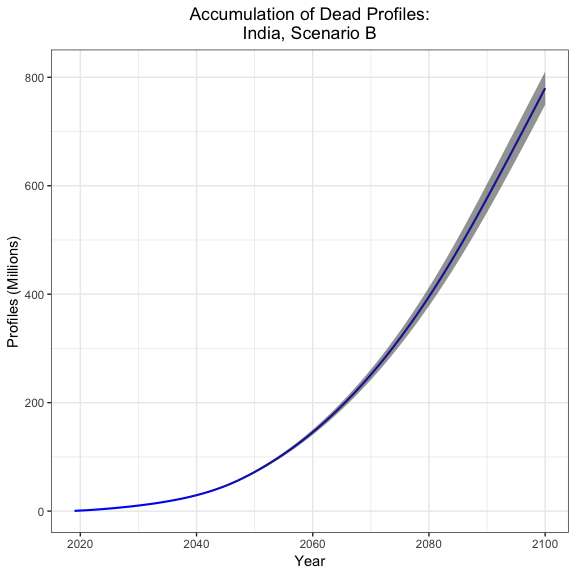
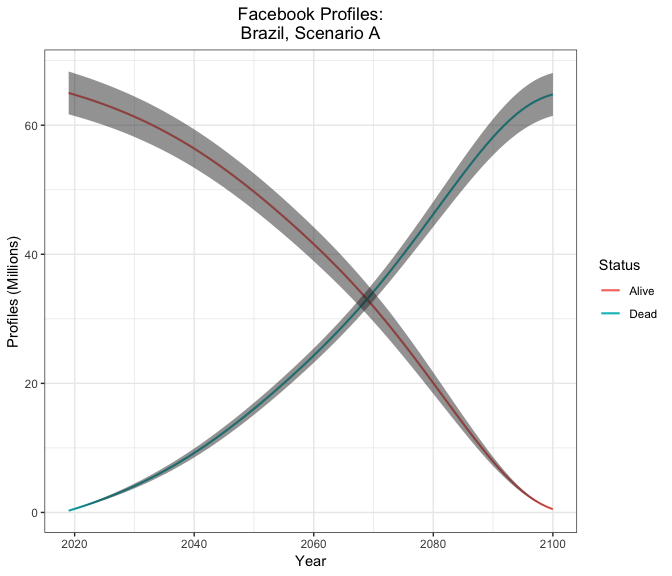

Are the Dead Taking Over Facebook?
================

This GitHub repository contains data, scripts, and results for the paper "Are the dead taking over Facebook? A big data approach to the future of death online" ([Öhman & Watson, 2019](https://arxiv.org/abs/1811.03416)).

From the abstract:

> We project the future accumulation of profiles belonging to deceased Facebook users. Our analysis suggests that a minimum of 1.4 billion users will pass away before 2100 if Facebook ceases to attract new users as of 2018. If the network continues expanding at current rates, however, this number will exceed 4.9 billion. In both cases, a majority of the profiles will belong to non-Western users. In discussing our findings, we draw on the emerging scholarship on digital preservation and stress the challenges arising from curating the profiles of the deceased. We argue that an exclusively commercial approach to data preservation poses important ethical and political risks that demand urgent consideration. We call for a scalable, sustainable, and dignified curation model that incorporates the interests of multiple stakeholders.

Our models compute the expected number of Facebook profiles belonging to living and dead users for (almost) all countries and age groups throughout the 21st century under two alternative scenarios. In Scenario A, we assume that no new users will join the network starting in 2018 and that users will only leave the network by dying. In Scenario B, we assume that user growth will continue at its current pace of 13% per year in all markets until reaching a penetration rate of 100%. Though both scenarios are extreme, they provide lower and upper bounds, respectively, on the conceivable growth of the social network.

We note that our projections begin in 2018 and therefore exclude all profiles belonging to users who died prior to this year. To the best of our knowledge, data on current totals of dead Facebook profiles are not publicly available.

All analysis was conducted in R version 3.5.2. Computations were performed on a MacBook Pro with 16GB of RAM and an i7 8-core processor. Note that it takes a little over 4 minutes to execute the global\_models.R script on said laptop and a little over 34 hours to run bootstrap.R. We've saved output the outputs of both scripts in the [Results](https://github.com/dswatson/Deaths_on_FB/tree/master/Results/Models) directory.

Using these data, we can plot the projected accumulation of dead profiles for any given combination of country and scenario.

``` r
# Load libraries
library(data.table)
library(tidyverse)

# Import data
df <- rbind(readRDS('./Results/Models/global_shrinking_boot.rds'),
            readRDS('./Results/Models/global_growing_boot.rds'))

# Plotting function
plot_cumsum <- function(country, scenario) {
  # Filter out the living
  df <- df[Status == 'Dead']
  # Filter by country
  df <- df[Country == country]
  # Filter by scenario
  if (scenario == 'A') {
    df <- df[Assumption == 'Shrinking']
  } else if (scenario == 'B') {
    df <- df[Assumption == 'Growing']
  }
  # Compute cumulative sum
  df[, CumSum := cumsum(Profiles) / 1000, by = Run]
  # Compute mean and standard error
  df[, Mean := mean(CumSum), by = Year]
  df[, SE := sd(CumSum), by = Year]
  # Filter
  df <- distinct(df[, .(Year, Mean, SE)])
  # Plot
  ggplot(df, aes(Year, Mean)) + 
    geom_line(size = 0.75, color = 'blue') + 
    geom_ribbon(aes(ymin = Mean - SE, ymax = Mean + SE), alpha = 0.25) +
    labs(title = paste0('Accumulation of Dead Profiles:\n',
                        country, ', Scenario ', scenario),
         y = 'Profiles (Millions)') + 
    theme_bw() + 
    theme(plot.title = element_text(hjust = 0.5))
}

# How about India under Scenario A?
plot_cumsum(country = 'India', scenario = 'B')
```



We can also plot growth curves for living and dead users for any country-scenario.

``` r
# Plotting function
plot_status <- function(country, scenario) {
  # Filter by country
  df <- df[Country == country]
  # Filter by scenario
  if (scenario == 'A') {
    df <- df[Assumption == 'Shrinking']
  } else if (scenario == 'B') {
    df <- df[Assumption == 'Growing']
  }
  # Set to millions
  df[, Profiles := Profiles / 1000]
  # Compute cumulative sum
  df[Status == 'Dead', Profiles := cumsum(Profiles), by = Run]
  # Compute mean and standard error
  df[, Mean := mean(Profiles), by = .(Status, Year)]
  df[, SE := sd(Profiles), by = .(Status, Year)]
  # Filter
  df <- distinct(df[, .(Status, Year, Mean, SE)])
  # Plot
  ggplot(df, aes(Year, Mean, group = Status)) + 
    geom_line(aes(color = Status), size = 0.75) + 
    geom_ribbon(aes(ymin = Mean - SE, ymax = Mean + SE), alpha = 0.25) + 
    labs(title = paste0('Facebook Profiles:\n', 
                        country, ', Scenario ', scenario),
         y = 'Profiles (Millions)') + 
    theme_bw() + 
    theme(plot.title = element_text(hjust = 0.5))
}

# How about Brazil under scenario A?
plot_status(country = 'Brazil', scenario = 'A')
```



According to our projections, the dead will outnumber the living on Facebook in Brazil sometime around 2069.

See ([Öhman & Watson, 2019](https://arxiv.org/abs/1811.03416)) for more details.
